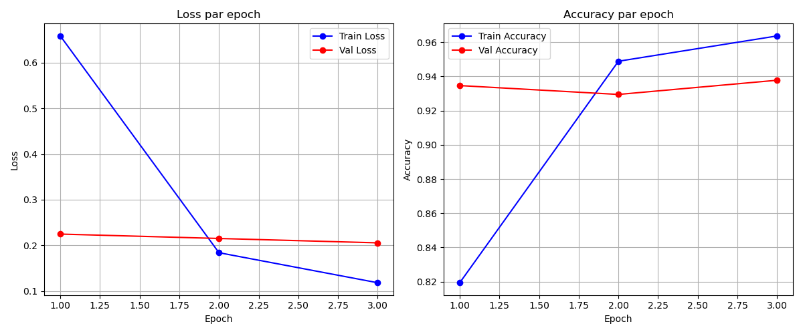
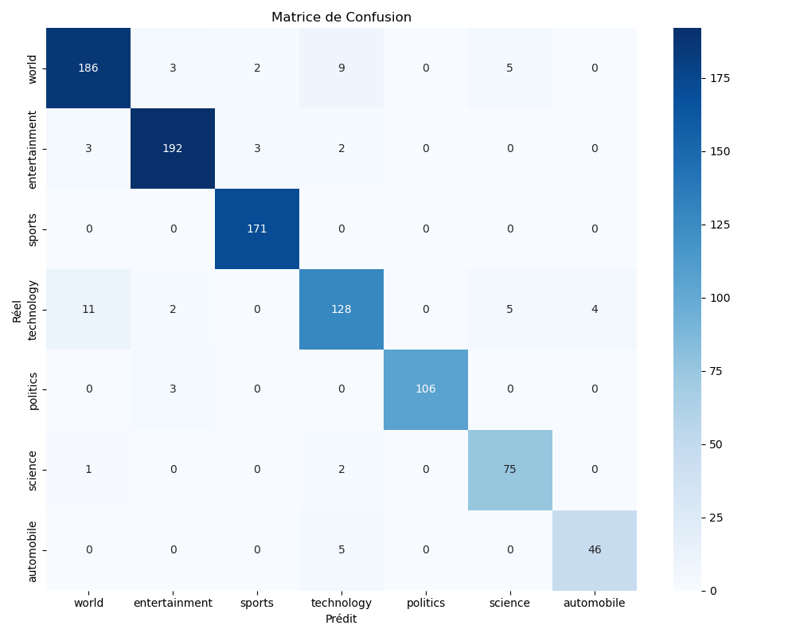

# bert-classification-news-inshort
# NLP avec PyTorch – Fine-Tuning de BERT

## Membres du binôme
- Aboubicre CISSE
- Emmanuel Takor Iwuobi

## Présentation du Dataset
Dataset : Inshort News Dataset
Nombre total d'exemples : 4817
Nombre de classes : 7 (automobile, entertainment, politics, science, sports, technology, world)

## Distribution des classes
| Classe        | Nombre |
|---------------|-------:|
| world         |   1021 |
| entertainment |    998 |
| sports        |    856 |
| technology    |    751 |
| politics      |    546 |
| science       |    389 |
| automobile    |    256 |

Déséquilibre modéré 4:1 — F1-score pondéré utilisé.

## Longueur des textes
Minimum : 41 mots | Maximum : 60 mots | Moyenne : 58 mots
MAX_LENGTH = 128 choisi pour couvrir tous les textes.

## Modèle
bert-base-uncased — dataset anglais, robuste, pré-entraîné sur Wikipedia + BookCorpus.

## Hyperparamètres
Learning Rate = 2e-5 | Batch Size = 16 | Epochs = 3 | Max Length = 128 | Weight Decay = 0.01 | Optimiseur = AdamW | Seed = 42

## Architecture
BERT Encoder → [CLS] token → Linear(768 → 7) → Softmax

## Résultats

| Epoch | Train Loss | Train Acc | Val Loss | Val Acc | Val F1 |
|-------|-----------|-----------|----------|---------|--------|
| 1     | 0.6585    | 81.94%    | 0.2246   | 93.46%  | 93.46% |
| 2     | 0.1838    | 94.89%    | 0.2150   | 92.95%  | 92.86% |
| 3     | 0.1180    | 96.37%    | 0.2054   | 93.78%  | 93.76% |

Meilleur modèle : Val Accuracy 93.78% | Val F1 93.76% | Epoch 3

## Courbes

## Matrice de Confusion

## Démo Gradio

## Installation
pip install -r requirements.txt

## Entraînement
python train.py

## Démo
python demo.py

## Difficultés Rencontrées
- Conflit OpenMP sur Windows résolu avec KMP_DUPLICATE_LIB_OK=TRUE
- Incompatibilité entre fichiers lors de la collaboration Git
- Temps d'entraînement long sur CPU
- Gestion du .gitignore pour fichiers lourds

## Conclusion
Le fine-tuning de BERT a atteint 93.78% accuracy et 93.76% F1 en 3 epochs, démontrant l'efficacité du transfer learning en NLP.
